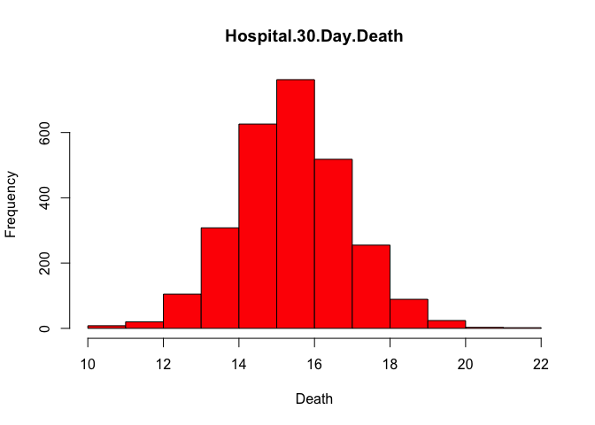

Assignment \#3
================
Hugo O. Matus

-----

###### Datascience Specialization Course: John Hopkins University

-----

#### Introduction

Download the file ProgAssignment3-data.zip file containing the data for
Programming Assignment 3 from the Coursera web site. Unzip the file in a
directory that will serve as your working directory. When you start up R
make sure to change your working directory to the directory where you
unzipped the data.

The data for this assignment come from the Hospital Compare web site
(<http://hospitalcompare.hhs.gov>) run by the U.S. Department of Health
and Human Services. The purpose of the web site is to provide data and
information about the quality of care at over 4,000 Medicare-certified
hospitals in the U.S. This dataset essentially covers all major U.S.
hospitals. This dataset is used for a variety of purposes, including
determining whether hospitals should be fined for not providing high
quality care to patients (see <http://goo.gl/jAXFX> for some background
on this particular topic).

The Hospital Compare web site contains a lot of data and we will only
look at a small subset for this assignment. The zip file for this
assignment contains three files

  - outcome-of-care-measures.csv: Contains information about 30-day
    mortality and readmission rates for heart attacks, heart failure,
    and pneumonia for over 4,000 hospitals.
  - hospital-data.csv: Contains information about each hospital.
  - Hospital\_Revised\_Flatfiles.pdf: Descriptions of the variables in
    each file (i.e the code book).

A description of the variables in each of the files is in the included
PDF file named Hospital\_Revised\_Flatfiles.pdf. This document contains
information about many other files that are not included with this
programming assignment. You will want to focus on the variables for
Number 19 (“Outcome of Care Measures.csv”) and Number 11 (“Hospital
Data.csv”). You may find it useful to print out this document (at least
the pages for Tables 19 and 11) to have next to you while you work on
this assignment. In particular, the numbers of the variables for each
table indicate column indices in each table (i.e. “Hospital Name” is
column 2 in the outcome-of-care-measures.csv file).

-----

#### 1\. Plot the 30-day mortality rates for heart attack

``` r
old.dir <- getwd()
data.dir <- "data/rprog_data_ProgAssignment3-data/"
setwd(data.dir)
outcome <-
  read.csv("outcome-of-care-measures.csv", colClasses = "character")
str(outcome)
```

    ## 'data.frame':    4706 obs. of  46 variables:
    ##  $ Provider.Number                                                                      : chr  "010001" "010005" "010006" "010007" ...
    ##  $ Hospital.Name                                                                        : chr  "SOUTHEAST ALABAMA MEDICAL CENTER" "MARSHALL MEDICAL CENTER SOUTH" "ELIZA COFFEE MEMORIAL HOSPITAL" "MIZELL MEMORIAL HOSPITAL" ...
    ##  $ Address.1                                                                            : chr  "1108 ROSS CLARK CIRCLE" "2505 U S HIGHWAY 431 NORTH" "205 MARENGO STREET" "702 N MAIN ST" ...
    ##  $ Address.2                                                                            : chr  "" "" "" "" ...
    ##  $ Address.3                                                                            : chr  "" "" "" "" ...
    ##  $ City                                                                                 : chr  "DOTHAN" "BOAZ" "FLORENCE" "OPP" ...
    ##  $ State                                                                                : chr  "AL" "AL" "AL" "AL" ...
    ##  $ ZIP.Code                                                                             : chr  "36301" "35957" "35631" "36467" ...
    ##  $ County.Name                                                                          : chr  "HOUSTON" "MARSHALL" "LAUDERDALE" "COVINGTON" ...
    ##  $ Phone.Number                                                                         : chr  "3347938701" "2565938310" "2567688400" "3344933541" ...
    ##  $ Hospital.30.Day.Death..Mortality..Rates.from.Heart.Attack                            : chr  "14.3" "18.5" "18.1" "Not Available" ...
    ##  $ Comparison.to.U.S..Rate...Hospital.30.Day.Death..Mortality..Rates.from.Heart.Attack  : chr  "No Different than U.S. National Rate" "No Different than U.S. National Rate" "No Different than U.S. National Rate" "Number of Cases Too Small" ...
    ##  $ Lower.Mortality.Estimate...Hospital.30.Day.Death..Mortality..Rates.from.Heart.Attack : chr  "12.1" "14.7" "14.8" "Not Available" ...
    ##  $ Upper.Mortality.Estimate...Hospital.30.Day.Death..Mortality..Rates.from.Heart.Attack : chr  "17.0" "23.0" "21.8" "Not Available" ...
    ##  $ Number.of.Patients...Hospital.30.Day.Death..Mortality..Rates.from.Heart.Attack       : chr  "666" "44" "329" "14" ...
    ##  $ Footnote...Hospital.30.Day.Death..Mortality..Rates.from.Heart.Attack                 : chr  "" "" "" "number of cases is too small (fewer than 25) to reliably tell how well the hospital is performing" ...
    ##  $ Hospital.30.Day.Death..Mortality..Rates.from.Heart.Failure                           : chr  "11.4" "15.2" "11.3" "13.6" ...
    ##  $ Comparison.to.U.S..Rate...Hospital.30.Day.Death..Mortality..Rates.from.Heart.Failure : chr  "No Different than U.S. National Rate" "Worse than U.S. National Rate" "No Different than U.S. National Rate" "No Different than U.S. National Rate" ...
    ##  $ Lower.Mortality.Estimate...Hospital.30.Day.Death..Mortality..Rates.from.Heart.Failure: chr  "9.5" "12.2" "9.1" "10.0" ...
    ##  $ Upper.Mortality.Estimate...Hospital.30.Day.Death..Mortality..Rates.from.Heart.Failure: chr  "13.7" "18.8" "13.9" "18.2" ...
    ##  $ Number.of.Patients...Hospital.30.Day.Death..Mortality..Rates.from.Heart.Failure      : chr  "741" "234" "523" "113" ...
    ##  $ Footnote...Hospital.30.Day.Death..Mortality..Rates.from.Heart.Failure                : chr  "" "" "" "" ...
    ##  $ Hospital.30.Day.Death..Mortality..Rates.from.Pneumonia                               : chr  "10.9" "13.9" "13.4" "14.9" ...
    ##  $ Comparison.to.U.S..Rate...Hospital.30.Day.Death..Mortality..Rates.from.Pneumonia     : chr  "No Different than U.S. National Rate" "No Different than U.S. National Rate" "No Different than U.S. National Rate" "No Different than U.S. National Rate" ...
    ##  $ Lower.Mortality.Estimate...Hospital.30.Day.Death..Mortality..Rates.from.Pneumonia    : chr  "8.6" "11.3" "11.2" "11.6" ...
    ##  $ Upper.Mortality.Estimate...Hospital.30.Day.Death..Mortality..Rates.from.Pneumonia    : chr  "13.7" "17.0" "15.8" "19.0" ...
    ##  $ Number.of.Patients...Hospital.30.Day.Death..Mortality..Rates.from.Pneumonia          : chr  "371" "372" "836" "239" ...
    ##  $ Footnote...Hospital.30.Day.Death..Mortality..Rates.from.Pneumonia                    : chr  "" "" "" "" ...
    ##  $ Hospital.30.Day.Readmission.Rates.from.Heart.Attack                                  : chr  "19.0" "Not Available" "17.8" "Not Available" ...
    ##  $ Comparison.to.U.S..Rate...Hospital.30.Day.Readmission.Rates.from.Heart.Attack        : chr  "No Different than U.S. National Rate" "Number of Cases Too Small" "No Different than U.S. National Rate" "Number of Cases Too Small" ...
    ##  $ Lower.Readmission.Estimate...Hospital.30.Day.Readmission.Rates.from.Heart.Attack     : chr  "16.6" "Not Available" "14.9" "Not Available" ...
    ##  $ Upper.Readmission.Estimate...Hospital.30.Day.Readmission.Rates.from.Heart.Attack     : chr  "21.7" "Not Available" "21.5" "Not Available" ...
    ##  $ Number.of.Patients...Hospital.30.Day.Readmission.Rates.from.Heart.Attack             : chr  "728" "21" "342" "1" ...
    ##  $ Footnote...Hospital.30.Day.Readmission.Rates.from.Heart.Attack                       : chr  "" "number of cases is too small (fewer than 25) to reliably tell how well the hospital is performing" "" "number of cases is too small (fewer than 25) to reliably tell how well the hospital is performing" ...
    ##  $ Hospital.30.Day.Readmission.Rates.from.Heart.Failure                                 : chr  "23.7" "22.5" "19.8" "27.1" ...
    ##  $ Comparison.to.U.S..Rate...Hospital.30.Day.Readmission.Rates.from.Heart.Failure       : chr  "No Different than U.S. National Rate" "No Different than U.S. National Rate" "Better than U.S. National Rate" "No Different than U.S. National Rate" ...
    ##  $ Lower.Readmission.Estimate...Hospital.30.Day.Readmission.Rates.from.Heart.Failure    : chr  "21.3" "19.2" "17.2" "22.4" ...
    ##  $ Upper.Readmission.Estimate...Hospital.30.Day.Readmission.Rates.from.Heart.Failure    : chr  "26.5" "26.1" "22.9" "31.9" ...
    ##  $ Number.of.Patients...Hospital.30.Day.Readmission.Rates.from.Heart.Failure            : chr  "891" "264" "614" "135" ...
    ##  $ Footnote...Hospital.30.Day.Readmission.Rates.from.Heart.Failure                      : chr  "" "" "" "" ...
    ##  $ Hospital.30.Day.Readmission.Rates.from.Pneumonia                                     : chr  "17.1" "17.6" "16.9" "19.4" ...
    ##  $ Comparison.to.U.S..Rate...Hospital.30.Day.Readmission.Rates.from.Pneumonia           : chr  "No Different than U.S. National Rate" "No Different than U.S. National Rate" "No Different than U.S. National Rate" "No Different than U.S. National Rate" ...
    ##  $ Lower.Readmission.Estimate...Hospital.30.Day.Readmission.Rates.from.Pneumonia        : chr  "14.4" "15.0" "14.7" "15.9" ...
    ##  $ Upper.Readmission.Estimate...Hospital.30.Day.Readmission.Rates.from.Pneumonia        : chr  "20.4" "20.6" "19.5" "23.2" ...
    ##  $ Number.of.Patients...Hospital.30.Day.Readmission.Rates.from.Pneumonia                : chr  "400" "374" "842" "254" ...
    ##  $ Footnote...Hospital.30.Day.Readmission.Rates.from.Pneumonia                          : chr  "" "" "" "" ...

``` r
setwd(old.dir)
```

``` r
outcome[,11] <- as.numeric(outcome[,11])
```

    ## Warning: NAs introduced by coercion

``` r
hist(outcome[,11],col = 2, main = "Hospital.30.Day.Death",xlab = "Death" )
```

<!-- -->

-----

#### 2\. Finding the best hospital in a state

Write a function called best that take two arguments: the 2-character
abbreviated name of a state and an outcome name. The function reads the
outcome-of-care-measures.csv file and returns a character vector with
the name of the hospital that has the best (i.e. lowest) 30-day
mortality for the specified outcome in that state. The hospital name is
the name provided in the Hospital.Name variable. The outcomes can be one
of “heart attack”, “heart failure”, or “pneumonia”. Hospitals that do
not have data on a particular outcome should be excluded from the set of
hospitals when deciding the rankings.

#### Handling ties.

If there is a tie for the best hospital for a given outcome, then the
hospital names should be sorted in alphabetical order and the first
hospital in that set should be chosen (i.e. if hospitals “b”, “c”, and
“f” are tied for best, then hospital “b” should be returned).

``` r
best <- function(state, outcome) {
  
  ## Read outcome data
  old.dir <- getwd()
  data.dir <- "data/rprog_data_ProgAssignment3-data/"
  setwd(data.dir)
  
  data <-
    read.csv(
      "outcome-of-care-measures.csv",
      na.strings = "Not Available",
      stringsAsFactors = FALSE,
      check.names = TRUE
    )
  
  setwd(old.dir)
  
  ## Check that state and outcome are valid
  
  outcome_values <-
    c(
      "heart attack" = 4,
      "heart failure" = 5,
      "pneumonia" = 6
    )
  
  ## state check
  if (length(which(state.abb == state)) == 0) {
    stop(call. = FALSE,
         paste("in best(", state, ", ", outcome, ")", " : invalid state"))
  }
  
  ## outcome check
  if (length(which(names(outcome_values) == outcome)) == 0) {
    stop(call. = FALSE,
         paste("in best(", state, ", ", outcome, ")", " :  invalid outcome"))
  }
  
  ## Return hospital name in that state with lowest 30-day death
  ## rate
  
  mortality_30_day <- data[, c(1, 2, 7, 11, 17, 23)]

  ## filter and get data for state requested
  obs <- mortality_30_day[mortality_30_day[, 3] == state, ]
  
  ## order filtered data by outcome and by hospital name
  obs <- obs[order(obs[, outcome_values[outcome]], obs[,2]), ]
  
  return(obs[1,2])
}
```

The function should check the validity of its arguments. If an invalid
state value is passed to best, the function should throw an error via
the stop function with the exact message “invalid state”. If an invalid
outcome value is passed to best, the function should throw an error via
the stop function with the exact message “invalid outcome”.

#### Here are some sample output from the function.

``` r
best("TX", "heart attack")
```

    ## [1] "CYPRESS FAIRBANKS MEDICAL CENTER"

``` r
best("TX", "heart failure")
```

    ## [1] "FORT DUNCAN MEDICAL CENTER"

``` r
best("MD", "heart attack")
```

    ## [1] "JOHNS HOPKINS HOSPITAL, THE"

``` r
best("MD", "pneumonia")
```

    ## [1] "GREATER BALTIMORE MEDICAL CENTER"

-----

#### 3 Ranking hospitals by outcome in a state

Write a function called rankhospital that takes three arguments: the
2-character abbreviated name of a state (state), an outcome (outcome),
and the ranking of a hospital in that state for that outcome (num). The
function reads the outcome-of-care-measures.csv file and returns a
character vector with the name of the hospital that has the ranking
specified by the num argument.

For example, the call

``` r
source("script/pollutantmean.R")
rankhospital("MD", "heart failure", 5)
```

    ##                  Hospital Outcome
    ## 1876 SAINT AGNES HOSPITAL     9.3

would return a character vector containing the name of the hospital with
the 5th lowest 30-day death rate for heart failure. The num argument can
take values “best”, “worst”, or an integer indicating the ranking
(smaller numbers are better). If the number given by num is larger than
the number of hospitals in that state, then the function should return
NA. Hospitals that do not have data on a particular outcome should be
excluded from the set of hospitals when deciding the rankings.

#### Handling ties.

It may occur that multiple hospitals have the same 30-day mortality rate
for a given cause of death. In those cases ties should be broken by
using the hospital name. For example, in Texas (“TX”), the hospitals
with lowest 30-day mortality rate for heart failure are shown here.

ROW\_NUM Hospital.Name Rate Rank

3935 FORT DUNCAN MEDICAL CENTER 8.1 1

4085 TOMBALL REGIONAL MEDICAL CENTER 8.5 2

4103 CYPRESS FAIRBANKS MEDICAL CENTER 8.7 3

3954 DETAR HOSPITAL NAVARRO 8.7 4

4010 METHODIST HOSPITAL,THE 8.8 5

3962 MISSION REGIONAL MEDICAL CENTER 8.8 6

Note that Cypress Fairbanks Medical Center and Detar Hospital Navarro
both have the same 30-day rate (8.7). However, because Cypress comes
before Detar alphabetically, Cypress is ranked number 3 in this scheme
and Detar is ranked number 4. One can use the order function to sort
multiple vectors in this manner (i.e. where one vector is used to break
ties in another vector).

The function should use the following template.

``` r
rankhospital <- function(state, outcome, num = "best") {
  ## Read outcome data
  old.dir <- getwd()
  data.dir <- "data/rprog_data_ProgAssignment3-data/"
  setwd(data.dir)
  
  data <-
    read.csv(
      "outcome-of-care-measures.csv",
      na.strings = "Not Available",
      stringsAsFactors = FALSE,
      check.names = TRUE
    )
  
  setwd(old.dir)
  
  ## Check that state and outcome are valid
  
  outcome_values <-
    c(
      "heart attack" = 4,
      "heart failure" = 5,
      "pneumonia" = 6
    )
  
  ## state check
  if (length(which(state.abb == state)) == 0) {
    stop(call. = FALSE,
         paste("in best(", state, ", ", outcome, ")", " : invalid state"))
  }
  
  ## outcome check
  if (length(which(names(outcome_values) == outcome)) == 0) {
    stop(call. = FALSE,
         paste("in best(", state, ", ", outcome, ")", " :  invalid outcome"))
  }
  
  ## Return hospital name in that state with lowest 30-day death
  ## rate
  
  mortality_30_day <- data[, c(1, 2, 7, 11, 17, 23)]
  
  ## filter and get data for state requested
  obs <- mortality_30_day[mortality_30_day[, 3] == state,]
  
  ## order filtered data by outcome and by hospital name
  obs <- obs[order(obs[, outcome_values[outcome]], obs[, 2]),]
  obs <- obs[complete.cases(obs[,outcome_values[outcome]]),]
  
  if (num == "best") {
    return(obs[1, 2])
  } else if (num == "worst") {
    return(obs[nrow(obs), 2])
  } else {
    return(obs[num, 2])
  }
}
```

#### Here is some sample output from the function.

``` r
rankhospital("TX", "heart failure", 4)
```

    ## [1] "DETAR HOSPITAL NAVARRO"

``` r
rankhospital("MD", "heart attack", "worst")
```

    ## [1] "HARFORD MEMORIAL HOSPITAL"

``` r
rankhospital("MN", "heart attack", 5000)
```

    ## [1] NA

-----

#### 4 Ranking hospitals in all states

Write a function called rankall that takes two arguments: an outcome
name (outcome) and a hospital ranking (num). The function reads the
outcome-of-care-measures.csv file and returns a 2-column data frame
containing the hospital in each state that has the ranking specified in
num. For example the function call rankall(“heart attack”, “best”) would
return a data frame containing the names of the hospitals that are the
best in their respective states for 30-day heart attack death rates. The
function should return a value for every state (some may be NA). The
first column in the data frame is named hospital, which contains the
hospital name, and the second column is named state, which contains the
2-character abbreviation for the state name. Hospitals that do not have
data on a particular outcome should be excluded from the set of
hospitals when deciding the rankings.

#### Handling ties.

The rankall function should handle ties in the 30-day mortality rates in
the same way that the rankhospital function handles ties. The function
should use the following template.

``` r
rankall <- function(outcome, num = "best") {
  ## Read outcome data
  ## Check that state and outcome are valid
  ## For each state, find the hospital of the given rank
  ## Return a data frame with the hospital names and the
  ## (abbreviated) state name
  
  df <- data.frame(hospital = character(0), state = character(0))
  
  for (s in sort(state.abb)) {
    
    e <- rankhospital(s, outcome, num)
    
    if (!is.na(e)) {
      df <- rbind(df,data.frame("hospital" = e, "state" = s))
    }
  }
  
  return(df)
}
```

NOTE: For the purpose of this part of the assignment (and for
efficiency), your function should NOT call the rankhospital function
from the previous section.

The function should check the validity of its arguments. If an invalid
outcome value is passed to rankall, the function should throw an error
via the stop function with the exact message “invalid outcome”. The num
variable can take values “best”, “worst”, or an integer indicating the
ranking (smaller numbers are better). If the number given by num is
larger than the number of hospitals in that state, then the function
should return NA.

#### Here is some sample output from the function.

``` r
rankall("heart attack", "best")
```

    ##                                    hospital state
    ## 1          PROVIDENCE ALASKA MEDICAL CENTER    AK
    ## 2                  CRESTWOOD MEDICAL CENTER    AL
    ## 3                   ARKANSAS HEART HOSPITAL    AR
    ## 4                      MAYO CLINIC HOSPITAL    AZ
    ## 5         GLENDALE ADVENTIST MEDICAL CENTER    CA
    ## 6      ST MARYS HOSPITAL AND MEDICAL CENTER    CO
    ## 7                        WATERBURY HOSPITAL    CT
    ## 8         BAYHEALTH - KENT GENERAL HOSPITAL    DE
    ## 9                MOUNT SINAI MEDICAL CENTER    FL
    ## 10                 STEPHENS COUNTY HOSPITAL    GA
    ## 11                      HILO MEDICAL CENTER    HI
    ## 12              MARY GREELEY MEDICAL CENTER    IA
    ## 13                  PORTNEUF MEDICAL CENTER    ID
    ## 14                    SAINT JOSEPH HOSPITAL    IL
    ## 15   ST VINCENT HEART CENTER OF INDIANA LLC    IN
    ## 16                    KANSAS HEART HOSPITAL    KS
    ## 17        ST ELIZABETH MEDICAL CENTER NORTH    KY
    ## 18                ST FRANCIS MEDICAL CENTER    LA
    ## 19     BETH ISRAEL DEACONESS MEDICAL CENTER    MA
    ## 20              JOHNS HOPKINS HOSPITAL, THE    MD
    ## 21                            YORK HOSPITAL    ME
    ## 22                    MUNSON MEDICAL CENTER    MI
    ## 23                        ST MARYS HOSPITAL    MN
    ## 24                    BOONE HOSPITAL CENTER    MO
    ## 25                    WESLEY MEDICAL CENTER    MS
    ## 26                    BENEFIS HOSPITALS INC    MT
    ## 27       CAROLINAS MEDICAL CENTER-NORTHEAST    NC
    ## 28             SANFORD MEDICAL CENTER FARGO    ND
    ## 29           FAITH REGIONAL HEALTH SERVICES    NE
    ## 30                  CATHOLIC MEDICAL CENTER    NH
    ## 31             EAST ORANGE GENERAL HOSPITAL    NJ
    ## 32                      ST VINCENT HOSPITAL    NM
    ## 33      SUNRISE HOSPITAL AND MEDICAL CENTER    NV
    ## 34                     NYU HOSPITALS CENTER    NY
    ## 35                     JEWISH HOSPITAL, LLC    OH
    ## 36            OKLAHOMA HEART HOSPITAL SOUTH    OK
    ## 37               PORTLAND VA MEDICAL CENTER    OR
    ## 38                      DOYLESTOWN HOSPITAL    PA
    ## 39                          MIRIAM HOSPITAL    RI
    ## 40                      MUSC MEDICAL CENTER    SC
    ## 41 AVERA HEART HOSPITAL OF SOUTH DAKOTA LLC    SD
    ## 42    METHODIST MEDICAL CENTER OF OAK RIDGE    TN
    ## 43         CYPRESS FAIRBANKS MEDICAL CENTER    TX
    ## 44            DIXIE REGIONAL MEDICAL CENTER    UT
    ## 45       CHESAPEAKE REGIONAL MEDICAL CENTER    VA
    ## 46       FLETCHER ALLEN HOSPITAL OF VERMONT    VT
    ## 47   PROVIDENCE SACRED HEART MEDICAL CENTER    WA
    ## 48                    BELLIN MEMORIAL HSPTL    WI
    ## 49       MONONGALIA COUNTY GENERAL HOSPITAL    WV
    ## 50                   WYOMING MEDICAL CENTER    WY

``` r
rankall("heart failure", "best")
```

    ##                                                             hospital state
    ## 1                                           SOUTH PENINSULA HOSPITAL    AK
    ## 2                                 GEORGE H. LANIER MEMORIAL HOSPITAL    AL
    ## 3                       VA CENTRAL AR. VETERANS HEALTHCARE SYSTEM LR    AR
    ## 4                               BANNER GOOD SAMARITAN MEDICAL CENTER    AZ
    ## 5                                  CENTINELA HOSPITAL MEDICAL CENTER    CA
    ## 6                                          PARKER ADVENTIST HOSPITAL    CO
    ## 7                                            YALE-NEW HAVEN HOSPITAL    CT
    ## 8                                  BAYHEALTH - KENT GENERAL HOSPITAL    DE
    ## 9                          FLORIDA HOSPITAL HEARTLAND MEDICAL CENTER    FL
    ## 10                                                  DOCTORS HOSPITAL    GA
    ## 11                                            KUAKINI MEDICAL CENTER    HI
    ## 12                               MERCY MEDICAL CENTER - CEDAR RAPIDS    IA
    ## 13                            SAINT ALPHONSUS MEDICAL CENTER - NAMPA    ID
    ## 14                                    RUSH UNIVERSITY MEDICAL CENTER    IL
    ## 15                                         ST CATHERINE HOSPITAL INC    IN
    ## 16                                               HAYS MEDICAL CENTER    KS
    ## 17                                        WESTLAKE REGIONAL HOSPITAL    KY
    ## 18                                    WILLIS KNIGHTON MEDICAL CENTER    LA
    ## 19                                     ST ELIZABETH'S MEDICAL CENTER    MA
    ## 20                                   MEDSTAR GOOD SAMARITAN HOSPITAL    MD
    ## 21                MILES MEMORIAL HOSPITAL (LINCOLN COUNTY HEALTHCARE    ME
    ## 22                                        HARPER UNIVERSITY HOSPITAL    MI
    ## 23                        ESSENTIA HEALTH ST JOSEPH'S MEDICAL CENTER    MN
    ## 24                                        NORTH KANSAS CITY HOSPITAL    MO
    ## 25                                         SOUTH CENTRAL REG MED CTR    MS
    ## 26                                      COMMUNITY MEDICAL CENTER INC    MT
    ## 27                               FIRSTHEALTH MOORE REGIONAL HOSPITAL    NC
    ## 28                                        ST ALOISIUS MEDICAL CENTER    ND
    ## 29                                           NEBRASKA HEART HOSPITAL    NE
    ## 30                                          VALLEY REGIONAL HOSPITAL    NH
    ## 31                                      EAST ORANGE GENERAL HOSPITAL    NJ
    ## 32                              LOVELACE REGIONAL HOSPITAL - ROSWELL    NM
    ## 33                                             MOUNTAINVIEW HOSPITAL    NV
    ## 34                                  KINGSBROOK JEWISH MEDICAL CENTER    NY
    ## 35                                                 FAIRVIEW HOSPITAL    OH
    ## 36                                     DUNCAN REGIONAL HOSPITAL, INC    OK
    ## 37                                        PORTLAND VA MEDICAL CENTER    OR
    ## 38                                    PHILADELPHIA VA MEDICAL CENTER    PA
    ## 39                                                 WESTERLY HOSPITAL    RI
    ## 40                                           PALMETTO HEALTH BAPTIST    SC
    ## 41                          AVERA HEART HOSPITAL OF SOUTH DAKOTA LLC    SD
    ## 42                         WELLMONT HAWKINS COUNTY MEMORIAL HOSPITAL    TN
    ## 43                                        FORT DUNCAN MEDICAL CENTER    TX
    ## 44 VA SALT LAKE CITY HEALTHCARE - GEORGE E. WAHLEN VA MEDICAL CENTER    UT
    ## 45                                          SENTARA POTOMAC HOSPITAL    VA
    ## 46                                              SPRINGFIELD HOSPITAL    VT
    ## 47                                         HARBORVIEW MEDICAL CENTER    WA
    ## 48                                    AURORA ST LUKES MEDICAL CENTER    WI
    ## 49                                         FAIRMONT GENERAL HOSPITAL    WV
    ## 50                                        CHEYENNE VA MEDICAL CENTER    WY

``` r
rankall("pneumonia", "best")
```

    ##                                              hospital state
    ## 1                  YUKON KUSKOKWIM DELTA REG HOSPITAL    AK
    ## 2                       MARSHALL MEDICAL CENTER NORTH    AL
    ## 3                         STONE COUNTY MEDICAL CENTER    AR
    ## 4                                MAYO CLINIC HOSPITAL    AZ
    ## 5                         CEDARS-SINAI MEDICAL CENTER    CA
    ## 6                     EXEMPLA LUTHERAN MEDICAL CENTER    CO
    ## 7                                SAINT MARYS HOSPITAL    CT
    ## 8                                BEEBE MEDICAL CENTER    DE
    ## 9                          MOUNT SINAI MEDICAL CENTER    FL
    ## 10                          PIEDMONT FAYETTE HOSPITAL    GA
    ## 11                           PALI MOMI MEDICAL CENTER    HI
    ## 12                        MARY GREELEY MEDICAL CENTER    IA
    ## 13                 ST LUKES WOOD RIVER MEDICAL CENTER    ID
    ## 14                               LAKE FOREST HOSPITAL    IL
    ## 15                          INDIANA UNIVERSITY HEALTH    IN
    ## 16      COMMUNITY HOSPITAL, ONAGA AND ST MARYS CAMPUS    KS
    ## 17                              CASEY COUNTY HOSPITAL    KY
    ## 18                     WILLIS KNIGHTON MEDICAL CENTER    LA
    ## 19                                  FALMOUTH HOSPITAL    MA
    ## 20                   GREATER BALTIMORE MEDICAL CENTER    MD
    ## 21 MILES MEMORIAL HOSPITAL (LINCOLN COUNTY HEALTHCARE    ME
    ## 22                   BEAUMONT HOSPITAL, GROSSE POINTE    MI
    ## 23                                     MERCY HOSPITAL    MN
    ## 24                                   LIBERTY HOSPITAL    MO
    ## 25                         GREENWOOD LEFLORE HOSPITAL    MS
    ## 26                              BENEFIS HOSPITALS INC    MT
    ## 27                                       REX HOSPITAL    NC
    ## 28                      MERCY HOSPITAL OF VALLEY CITY    ND
    ## 29                         BOX BUTTE GENERAL HOSPITAL    NE
    ## 30                                EXETER HOSPITAL INC    NH
    ## 31              ENGLEWOOD HOSPITAL AND MEDICAL CENTER    NJ
    ## 32                         LOVELACE WESTSIDE HOSPITAL    NM
    ## 33              SPRING VALLEY HOSPITAL MEDICAL CENTER    NV
    ## 34                          MAIMONIDES MEDICAL CENTER    NY
    ## 35                GRANDVIEW HOSPITAL & MEDICAL CENTER    OH
    ## 36                         HILLCREST HOSPITAL CUSHING    OK
    ## 37                         PORTLAND VA MEDICAL CENTER    OR
    ## 38                            KANE COMMUNITY HOSPITAL    PA
    ## 39                                   NEWPORT HOSPITAL    RI
    ## 40             CAROLINA PINES REGIONAL MEDICAL CENTER    SC
    ## 41                      SIOUX FALLS VA MEDICAL CENTER    SD
    ## 42                     UNITED REGIONAL MEDICAL CENTER    TN
    ## 43 UNIVERSITY OF TEXAS HEALTH SCIENCE CENTER AT TYLER    TX
    ## 44                                       LDS HOSPITAL    UT
    ## 45                          NORTON COMMUNITY HOSPITAL    VA
    ## 46                    RUTLAND REGIONAL MEDICAL CENTER    VT
    ## 47                  EVERGREEN HOSPITAL MEDICAL CENTER    WA
    ## 48                              BELLIN MEMORIAL HSPTL    WI
    ## 49                             WEIRTON MEDICAL CENTER    WV
    ## 50                         CHEYENNE VA MEDICAL CENTER    WY

``` r
rankall("heart attack", "worst")
```

    ##                                                                hospital state
    ## 1                                        MAT-SU REGIONAL MEDICAL CENTER    AK
    ## 2                                        HELEN KELLER MEMORIAL HOSPITAL    AL
    ## 3                                         MEDICAL CENTER SOUTH ARKANSAS    AR
    ## 4                                           VERDE VALLEY MEDICAL CENTER    AZ
    ## 5                                      METHODIST HOSPITAL OF SACRAMENTO    CA
    ## 6                                         NORTH SUBURBAN MEDICAL CENTER    CO
    ## 7                                             JOHNSON MEMORIAL HOSPITAL    CT
    ## 8                                                 ST FRANCIS HEALTHCARE    DE
    ## 9                                             PALMETTO GENERAL HOSPITAL    FL
    ## 10                                          WEST GEORGIA MEDICAL CENTER    GA
    ## 11                                             PALI MOMI MEDICAL CENTER    HI
    ## 12                                                BOONE COUNTY HOSPITAL    IA
    ## 13                                EASTERN IDAHO REGIONAL MEDICAL CENTER    ID
    ## 14                                         SAINT ANTHONY MEDICAL CENTER    IL
    ## 15                                              MARION GENERAL HOSPITAL    IN
    ## 16                                                OLATHE MEDICAL CENTER    KS
    ## 17                                      MURRAY-CALLOWAY COUNTY HOSPITAL    KY
    ## 18                                              RIVER PARISHES HOSPITAL    LA
    ## 19                                                       NOBLE HOSPITAL    MA
    ## 20                                            HARFORD MEMORIAL HOSPITAL    MD
    ## 21                                            PENOBSCOT VALLEY HOSPITAL    ME
    ## 22                                                HURLEY MEDICAL CENTER    MI
    ## 23                                        HEALTHEAST ST JOHN'S HOSPITAL    MN
    ## 24                                 POPLAR BLUFF REGIONAL MEDICAL CENTER    MO
    ## 25                                 SOUTHWEST MS REGIONAL MEDICAL CENTER    MS
    ## 26                                           BOZEMAN DEACONESS HOSPITAL    MT
    ## 27                                              WAYNE MEMORIAL HOSPITAL    NC
    ## 28                                                       ALTRU HOSPITAL    ND
    ## 29 OMAHA VA MEDICAL CENTER (VA NEBRASKA WESTERN IOWA HEALTHCARE SYSTEM)    NE
    ## 30                                           FRANKLIN REGIONAL HOSPITAL    NH
    ## 31                    ROBERT WOOD JOHNSON UNIVERSITY HOSPITAL AT RAHWAY    NJ
    ## 32                                MOUNTAIN VIEW REGIONAL MEDICAL CENTER    NM
    ## 33                                              DESERT SPRINGS HOSPITAL    NV
    ## 34                                                F F THOMPSON HOSPITAL    NY
    ## 35                              MERCY FRANCISCAN HOSPITAL WESTERN HILLS    OH
    ## 36                                         MERCY MEMORIAL HEALTH CENTER    OK
    ## 37                                      THREE RIVERS COMMUNITY HOSPITAL    OR
    ## 38                                           EPHRATA COMMUNITY HOSPITAL    PA
    ## 39                                                    WESTERLY HOSPITAL    RI
    ## 40                                          WACCAMAW COMMUNITY HOSPITAL    SC
    ## 41                                               PRAIRIE LAKES HOSPITAL    SD
    ## 42                                    DYERSBURG REGIONAL MEDICAL CENTER    TN
    ## 43                                                LAREDO MEDICAL CENTER    TX
    ## 44                                                    ST MARKS HOSPITAL    UT
    ## 45                                      RIVERSIDE TAPPAHANNOCK HOSPITAL    VA
    ## 46                               NORTHEASTERN VERMONT REGIONAL HOSPITAL    VT
    ## 47                                       KADLEC REGIONAL MEDICAL CENTER    WA
    ## 48                                             HOLY FAMILY MEMORIAL INC    WI
    ## 49                                             THOMAS MEMORIAL HOSPITAL    WV
    ## 50                                           SHERIDAN MEMORIAL HOSPITAL    WY

``` r
rankall("heart failure", "worst")
```

    ##                                            hospital state
    ## 1                       FAIRBANKS MEMORIAL HOSPITAL    AK
    ## 2                    DEKALB REGIONAL MEDICAL CENTER    AL
    ## 3                     NEA BAPTIST MEMORIAL HOSPITAL    AR
    ## 4                 MT GRAHAM REGIONAL MEDICAL CENTER    AZ
    ## 5                   CLOVIS COMMUNITY MEDICAL CENTER    CA
    ## 6            CENTURA HEALTH-ST THOMAS MORE HOSPITAL    CO
    ## 7                      MANCHESTER MEMORIAL HOSPITAL    CT
    ## 8                              BEEBE MEDICAL CENTER    DE
    ## 9                         MANATEE MEMORIAL HOSPITAL    FL
    ## 10                   COFFEE REGIONAL MEDICAL CENTER    GA
    ## 11                     MAUI MEMORIAL MEDICAL CENTER    HI
    ## 12                            BOONE COUNTY HOSPITAL    IA
    ## 13                          KOOTENAI MEDICAL CENTER    ID
    ## 14                        SPARTA COMMUNITY HOSPITAL    IL
    ## 15      INDIANA UNIVERSITY HEALTH LA PORTE HOSPITAL    IN
    ## 16                     SOUTH CENTRAL KS  MED CENTER    KS
    ## 17                          CALDWELL MEDICAL CENTER    KY
    ## 18                   ABROM KAPLAN MEMORIAL HOSPITAL    LA
    ## 19                                 EMERSON HOSPITAL    MA
    ## 20                 GARRETT COUNTY MEMORIAL HOSPITAL    MD
    ## 21             SEBASTICOOK VALLEY HOSPITAL (HEALTH)    ME
    ## 22                              MEMORIAL HEALTHCARE    MI
    ## 23              MAYO CLINIC HEALTH SYSTEM - MANKATO    MN
    ## 24                   COMMUNITY HOSPITAL ASSOCIATION    MO
    ## 25                 NORTH MISSISSIPPI MEDICAL CENTER    MS
    ## 26                              ST PETER'S HOSPITAL    MT
    ## 27                            THE MCDOWELL HOSPITAL    NC
    ## 28                                TRINITY HOSPITALS    ND
    ## 29           ALEGENT HEALTH IMMANUEL MEDICAL CENTER    NE
    ## 30                       FRANKLIN REGIONAL HOSPITAL    NH
    ## 31                          SOMERSET MEDICAL CENTER    NJ
    ## 32                 SAN JUAN REGIONAL MEDICAL CENTER    NM
    ## 33             SAINT MARY'S REGIONAL MEDICAL CENTER    NV
    ## 34                  CAYUGA MEDICAL CENTER AT ITHACA    NY
    ## 35               COSHOCTON COUNTY MEMORIAL HOSPITAL    OH
    ## 36                          INTEGRIS GROVE HOSPITAL    OK
    ## 37                         ADVENTIST MEDICAL CENTER    OR
    ## 38                       SUNBURY COMMUNITY HOSPITAL    PA
    ## 39                        SOUTH COUNTY HOSPITAL INC    RI
    ## 40                    AIKEN REGIONAL MEDICAL CENTER    SC
    ## 41                      SPEARFISH REGIONAL HOSPITAL    SD
    ## 42                   ATHENS REGIONAL MEDICAL CENTER    TN
    ## 43                                    ETMC CARTHAGE    TX
    ## 44                              CASTLEVIEW HOSPITAL    UT
    ## 45 MEMORIAL HOSPITAL OF MARTINSVILLE & HENRY COUNTY    VA
    ## 46               FLETCHER ALLEN HOSPITAL OF VERMONT    VT
    ## 47                              MID VALLEY HOSPITAL    WA
    ## 48                             ST NICHOLAS HOSPITAL    WI
    ## 49                       OHIO VALLEY MEDICAL CENTER    WV
    ## 50                           WYOMING MEDICAL CENTER    WY

``` r
rankall("pneumonia", "worts")
```

    ## [1] hospital state   
    ## <0 rows> (or 0-length row.names)
